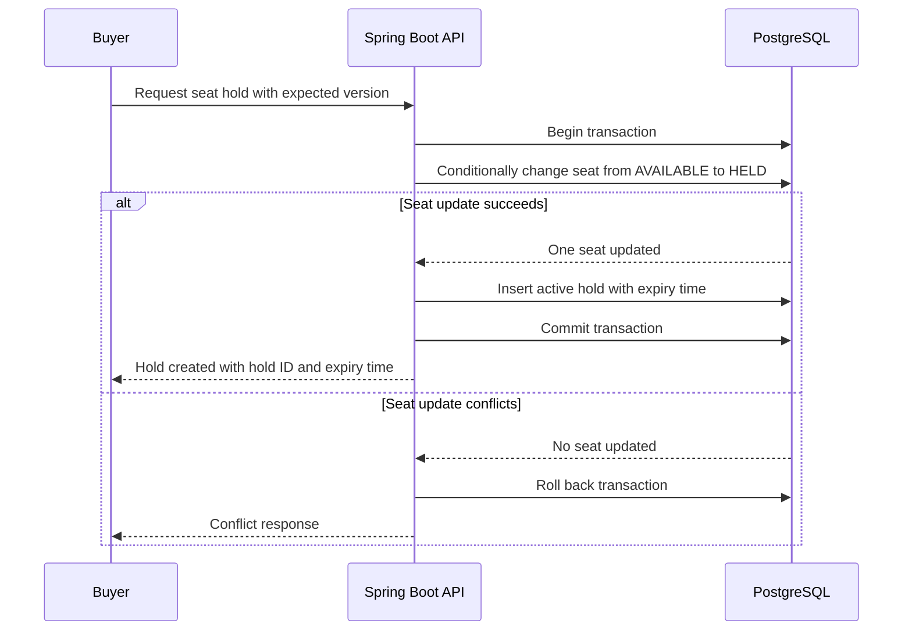
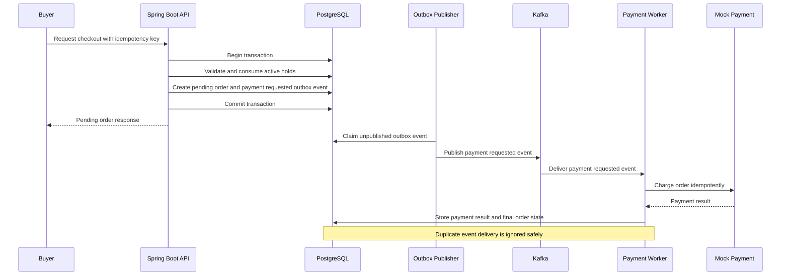
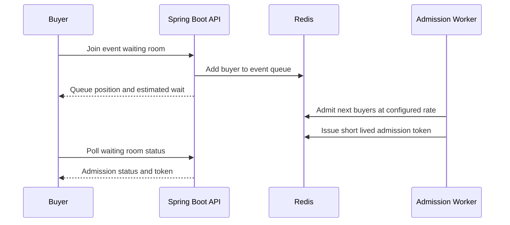
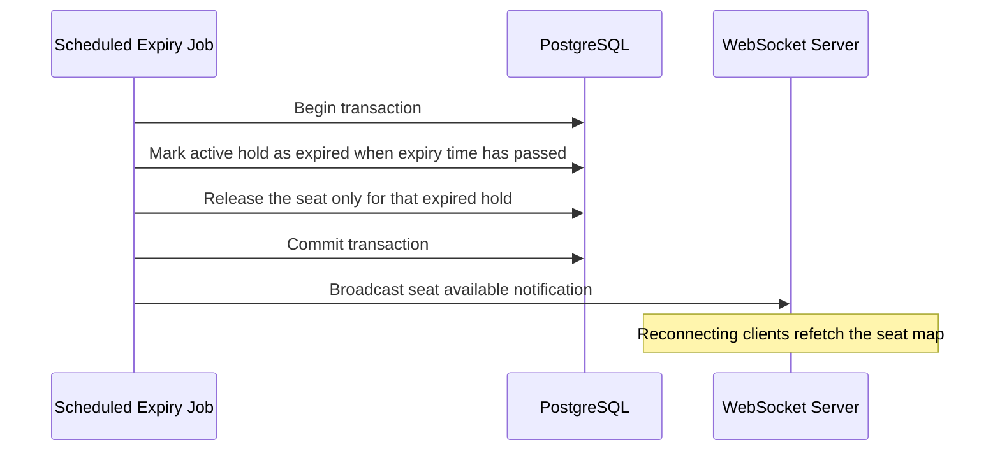

# Sequence Diagrams (text form — render with Mermaid)

## 1. Seat Hold (Stage 2)

```mermaid
sequenceDiagram
    participant Buyer
    participant API as Spring Boot API
    participant DB as PostgreSQL

    Buyer->>API: Request seat hold with expected version
    API->>DB: Begin transaction
    API->>DB: Conditionally change seat from AVAILABLE to HELD
    alt Seat update succeeds
        DB-->>API: One seat updated
        API->>DB: Insert active hold with expiry time
        API->>DB: Commit transaction
        API-->>Buyer: Hold created with hold ID and expiry time
    else Seat update conflicts
        DB-->>API: No seat updated
        API->>DB: Roll back transaction
        API-->>Buyer: Conflict response
    end
```

## 2. Checkout & Payment (Stage 4)

```mermaid
sequenceDiagram
    participant Buyer
    participant API as Spring Boot API
    participant DB as PostgreSQL
    participant OUT as Outbox Publisher
    participant K as Kafka
    participant W as Payment Worker
    participant Payment as Mock Payment

    Buyer->>API: Request checkout with idempotency key
    API->>DB: Begin transaction
    API->>DB: Validate and consume active holds
    API->>DB: Create pending order and payment requested outbox event
    API->>DB: Commit transaction
    API-->>Buyer: Pending order response
    OUT->>DB: Claim unpublished outbox event
    OUT->>K: Publish payment requested event
    K->>W: Deliver payment requested event
    W->>Payment: Charge order idempotently
    Payment-->>W: Payment result
    W->>DB: Store payment result and final order state
    Note over W,DB: Duplicate event delivery is ignored safely
```

## 3. Waiting Room Admission (Stage 4)

```mermaid
sequenceDiagram
    participant Buyer
    participant API as Spring Boot API
    participant Redis
    participant W as Admission Worker

    Buyer->>API: Join event waiting room
    API->>Redis: Add buyer to event queue
    API-->>Buyer: Queue position and estimated wait
    W->>Redis: Admit next buyers at configured rate
    W->>Redis: Issue short lived admission token
    Buyer->>API: Poll waiting room status
    API-->>Buyer: Admission status and token
```

## 4. Hold Expiry (Stage 2/4)

```mermaid
sequenceDiagram
    participant W as Scheduled Expiry Job
    participant DB as PostgreSQL
    participant WS as WebSocket Server

    W->>DB: Begin transaction
    W->>DB: Mark active hold as expired when expiry time has passed
    W->>DB: Release the seat only for that expired hold
    W->>DB: Commit transaction
    W->>WS: Broadcast seat available notification
    Note over WS: Reconnecting clients refetch the seat map
```
